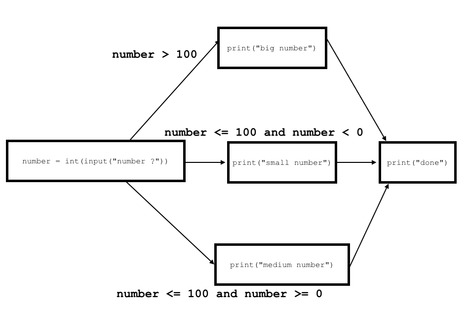

---
redirect_from:
  - "/05/4/if-elif"
interact_link: content/05/4/if_elif.ipynb
kernel_name: python3
has_widgets: false
title: 'if-elif Statements'
prev_page:
  url: /05/3/if_else
  title: 'if-else Statements'
next_page:
  url: /05/5/ifif_vs_ifelif
  title: 'if-then-if vs. if-elif Statements'
comment: "***PROGRAMMATICALLY GENERATED, DO NOT EDIT. SEE ORIGINAL FILES IN /content***"
---


`if/elif/else` statements
==============

`if` statements have multiple ways that we can customize them (other than changing the logical expression): the second of these ways is by adding an `elif` clause to our statement.

The syntax of `if/elif/else` statements is:

```python
if logical_expression:
    # do something
elif logical_expression2:
    # do something different
else:
    # do something different again
```

Let's take a look at our previous example code again.


<div markdown="1" class="cell code_cell">
<div class="input_area" markdown="1">
```python
# TODO: run this code!
# Under what circumstances is "big number" printed out?
# What about "small number"? What about "medium number"?
# Answer:

number = int(input("number? "))

if number > 100:
    print("big number")
elif number < 0:
    print("small number")
else:
    print("medium number")
    
print("done")

```
</div>

</div>




Notice that for each branch in our `if/elif/else` statement, we only take that branch if *__all of the previous conditional statements evaluated to `False`__*.


<div markdown="1" class="cell code_cell">
<div class="input_area" markdown="1">
```python
# TODO: run this code!
# What is different about this statement from the
# previous example?
# Answer:

number = int(input("number? "))

if number > 1000:
    print("extra big number")
elif number > 100:
    print("big number")
else:
    print("other number")
    
print("done")

```
</div>

</div>


Notice that "big number" is *__only__* printed out if the first test of `number > 1000` was `False`.

Order of testing/execution
------------------------

For all `if/elif/else` statements, the program always executes the tests from top to bottom and *__stops as soon as one test evaluates to `True`__*.


Variations the structure of `if/elif/else`
------------------------------

Any combination of `if/elif/else` together is considered one control statement. The requirements for each part of this control statement are as follows:

1. `if` - there must __always__ be __1 and only 1__ `if` statement at the beginning of your selection statement followed by a logical expression.
2. `elif` - there *may* be __1 or more__ `elif` statements. They must contain logical expressions and they must follow the `if` statement.
3. `else` - there *may* be __1 or 0__ `else` statements. The `else` statement can __never__ contain a logical expression. (Implicitly, the logical expression here is that all of the previous logical expressions were `False`.) 

At the bottom of this set of course notes are a series of different, valid variations on a single `if/elif/else` statement.

Note that all of these examples are for __only 1__ control statement.


<div markdown="1" class="cell code_cell">
<div class="input_area" markdown="1">
```python
# TODO: run this code!

# we'll talk about this code in the modules section
# -- basically we're getting 
# some random numbers so that the behavior of this code can change 
# when you run it different times
import random 

# random int from the list [0, 1, 2, 3, 4, 5, 6, 7, 8, 9]
# just like the range() function that we use with for loops!
x = random.randrange(0, 10)
y = random.randrange(0, 10)

print("x is: " + str(x))
print("y is: " + str(y))

```
</div>

</div>


<div markdown="1" class="cell code_cell">
<div class="input_area" markdown="1">
```python
# TODO: run this code!
# We'll be using the values of x and y generated in the
# code above for the rest of the code in this notebook!

# just an if statement
if x < y or x == 0:
    print("either [x is less than y] or [x is 0] or both!")

```
</div>

</div>


<div markdown="1" class="cell code_cell">
<div class="input_area" markdown="1">
```python
# if with an else
if x < y or x == 0:
    print("either [x is less than y] or [x is 0] or both!")
else:
    print("both of [x is greater than or equal to y] and [x is not 0]")

```
</div>

</div>


<div markdown="1" class="cell code_cell">
<div class="input_area" markdown="1">
```python
# if with an elif and no else
if x < y:
    print("[x is less than y]")
elif y % 2 == 0:
    print("[x is not less than y] and [y is even]") 

```
</div>

</div>


<div markdown="1" class="cell code_cell">
<div class="input_area" markdown="1">
```python
# if with an elif and an else
if x < y:
    print("[x is less than y]")
elif y % 2 == 0:
    print("[x is not less than y] and [y is even]") 
else:
    print("[x is not less than y] and [y is not even]") 

```
</div>

</div>


<div markdown="1" class="cell code_cell">
<div class="input_area" markdown="1">
```python
# if with more than 1 elif and an else
if x < y:
    print("[x is less than y]")
elif y % 2 == 0:
    print("[x is not less than y] and [y is even]") 
elif y < 5:
    print("[x is not less than y] and [y is not even] and [y is less than 5]") 
elif x < 5:
    print("[x is not less than y] and [y is not even] and [y is not less than 5] and [x is less than 5]") 
else:
    print("[x is not less than y] and [y is not even] and [y is not less than 5] and [x is not less than 5]") 

```
</div>

</div>

